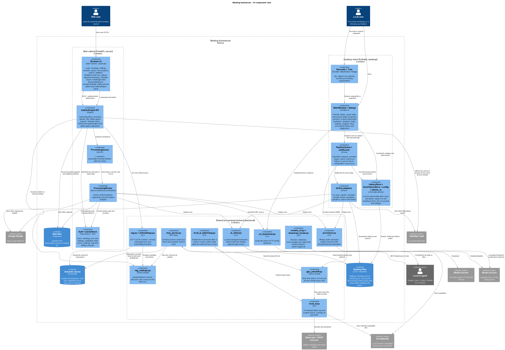
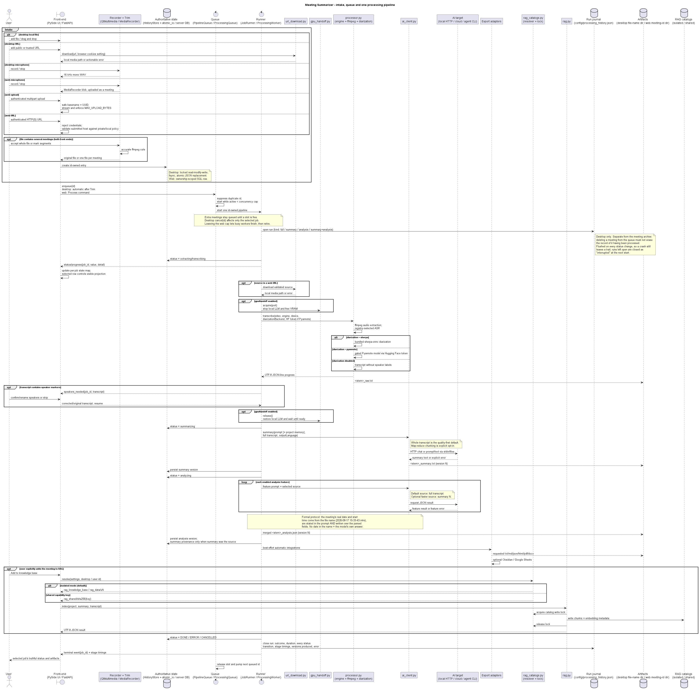

# Architecture — Meeting Summarizer (desktop + web)

**English** · [Русский](ARCHITECTURE.ru.md)

Meeting Summarizer has two front-ends over a shared, Qt-free Python processing
backend:

- the native **PySide6 desktop client** in `desktop/`;
- the multi-user **FastAPI web cabinet** in `server/`.

Both front-ends orchestrate the command-line contracts in `backend/` as isolated
subprocesses. The desktop uses Qt workers; the server uses asyncio workers. Progress
crosses the process boundary as UTF-8 JSON lines. The backend started as reused code
from the Electron application, but it has since been refactored into registry-driven
engines and shared CLIs; the stable boundary is now the CLI/JSON contract, not an
“untouched legacy backend”.

Diagrams:

The `.puml` files are the source; the rendered PNGs below are what GitHub shows
(it does not render PlantUML inline). Re-render with
`java -jar plantuml.jar -tpng -o . desktop/*.puml` after editing either source.

**C4 component view** — [source](architecture-c4-component.puml)

**Processing sequence** — [source](architecture-sequence.puml)

## Runtime layers

### Desktop UI (`desktop/app/ui`)

`MainWindow` owns file/URL intake, the visible queue, results and version selection.
Dialogs cover Settings, Trim, Recorder, Speakers, Analysis, RAG, Search, Diagnostics,
Stats, Processing history and the on-demand local-AI manager.

The UI deliberately separates **event state** from **the currently selected row**:

- queue events update table cells and `_live_by_job[job_id]`;
- selecting another row only changes which job's status, progress, timeline and
  artifacts are projected into the detail panels;
- progress from job A therefore cannot overwrite the visible details for selected
  job B;
- the status timeline has a fixed viewport and scrolls instead of growing the main
  window indefinitely.

Adding a file is an instruction to process it. After the Trim dialog returns the
original file or generated segments, each resulting file is persisted and enqueued
immediately. The **Process** button remains for explicit reruns and recovery of
persisted rows that have no active runner.

### Desktop orchestration (`desktop/app/core`)

- `HistoryStore` is the desktop source of truth for job status and artifact versions.
  Every addition receives a unique history id; all live signals and persisted versions
  are keyed by that id. Human-readable artifact directories are derived from sanitized
  file names and deduplicated on collision.
- Every meeting records the **intake channel** it arrived through (`HistoryEntry.source`):
  `file` for a dropped file or a URL download, `live` for a meeting recorded here and processed
  from the transcript live mode produced. It exists purely so the two can be told apart
  afterwards — in the queue row, the results panel, the journal and the log — because what they
  PRODUCE is deliberately identical: a live-sourced meeting gets the same transcript, summary
  version, analysis version and exports as any other. Entries written before the field existed
  read as `file`; every one of them came from a file, so that is the truthful default, not a
  placeholder.
- `RunHistoryStore` owns the separate **processing journal**, `config/processing_history.json`:
  one record per RUN (full, summary, analysis or summary+analysis), with its status
  transitions, stage timings, artifacts and error. The archive above answers "what does this
  meeting have"; the journal answers "when was it processed, how long did it take, why did it
  fail" — and because the queue table is rebuilt from the archive, deleting a row there must
  not erase that answer. `JobRunner` writes it from its own signals and flushes on every
  transition; runs left open by a kill are closed as `interrupted` at the next start.
- `atomic_io` protects `config/history.json`, `config/processing_history.json` and
  `config/settings.json` with an
  in-process lock, an OS file lock, a unique temporary file, `flush` + `fsync`, atomic
  replacement and retries for transient Windows locks. The lock covers the complete
  history read-modify-write transaction, preventing two app instances from silently
  replacing each other's state.
- `PipelineQueue` holds a pending deque and an active `job_id → JobRunner` map. `_pump()`
  starts work immediately while `active < max_concurrency`; excess jobs remain queued
  and start when a slot is released. Cancellation targets one selected id. Changing the
  cap never rewrites a running job.
- `JobRunner` owns one id and walks
  `EXTRACTING → TRANSCRIBING → SUMMARIZING → ANALYZING → DONE`, with terminal
  `ERROR` and `CANCELLED` paths. It emits id-bearing status, progress, stage timing,
  speaker-pause and completion signals.
- `QProcess`/`QThread` workers keep CLI and blocking operations off the UI thread.
  `device.probe` resolves the `auto` concurrency setting after startup; on one CUDA GPU
  it deliberately resolves to one pipeline job because concurrent ASR jobs compete for
  the same VRAM. A manually configured value is still passed to the queue as the user's
  explicit cap.

“Parallel workers” means concurrent **meeting pipelines**, not that every stage of one
meeting is split across that many jobs. Individual engines may have their own internal
CPU/GPU parallelism.

### Qt-free adapters (`desktop/app/backend`)

The adapters build CLI argument vectors for transcription, summary and analysis and
implement local features such as export, Obsidian, Google Sheets, templates, speakers,
literal search and ffmpeg probe/cut. They contain no Qt dependencies, which allows the
server and self-tests to reuse them.

### Shared processing backend (`backend/`)

- `processor.py` dispatches through `engines_registry.py` and per-engine adapters. It
  extracts audio and produces the timestamped raw transcript. WhisperX diarization can
  use the bundled sherpa-onnx pipeline or gated `pyannote.audio` models selected by
  `diarizationBackend`; Pyannote requires a Hugging Face token and accepted model terms.
- `ai_client.py` is the single summary/analysis transport for local HTTP, cloud APIs and
  local agent CLIs.
- `models_cli.py` and `download_model.py` resolve, download and update ASR models.
- `url_download.py` handles yt-dlp and direct HTTP media intake.
- `rag.py` + `embeddings.py` provide the Chroma semantic store and configurable embedding
  backends.
- `gpu_handoff.py` can stop a local LLM before ASR and restore it before AI processing.
  It covers both the user's own server (by port) and the app's built-in model (by id).
- `local_ai_watchdog.py` brings the built-in model back after a crash or reboot, and
  stands down while the hand-off lock is held.
- `local_ai.py` downloads and runs an on-demand llama.cpp server on its own port.
- `mcp_server.py` exposes archive reads and search to external agents over MCP stdio.
- `whisperx_patch.py` is a compatibility shim applied to WhisperX at import time.

## AI routing and quality policy

`ai_client.py` supports four deployment paths:

1. **local HTTP** — any OpenAI-compatible endpoint such as LM Studio, Ollama or
   llama.cpp;
2. **cloud API** — OpenAI, Anthropic, Google, xAI, Qwen, Mistral, DeepSeek, or a custom
   endpoint/body/header template;
3. **agent CLI** — Claude Code, Codex, Gemini CLI, Hermes, or another command. Large
   transcripts are passed through stdin or temporary files, not command-line arguments;
4. **built-in local AI** — an on-demand llama.cpp binary and curated GGUF under
   `resources/local_ai/`, normally served on port 8081 so an existing endpoint on 8080
   remains untouched.

The defaults are quality-first:

- `chunkingEnabled = false`: the whole transcript is sent in one request. Map-reduce
  chunking is an explicit compatibility option for a model whose context window cannot
  hold the meeting; enabling it can lose cross-chunk context.
- `analysisSource = transcript`: each enabled analysis feature reads the full transcript.
  Summary-based analysis is an explicit faster, less complete option.
- when analysis uses the transcript, its version has no summary provenance link; when it
  uses a summary, `source_summary_version` records the exact summary version.

These rules apply to both front-ends and to every provider, including agent CLIs. A model
context overflow is reported as an error when whole-transcript mode is selected; the
application does not silently truncate the source.

## State and storage ownership

| Surface | Authoritative state | Artifacts | Semantic store |
| --- | --- | --- | --- |
| Desktop | `config/settings.json`, `config/history.json` (meeting archive), `config/processing_history.json` (run journal — survives deleting a meeting from the queue) | `transcripts/<sanitized file name>/` | isolated: `rag_knowledge_base/`; shared: `rag_shared/<key sha256>/` |
| Web cabinet | `config/server.db` (or `DATABASE_URL`): per-user `user_settings`, installation-wide `server_settings` | uploads in `uploads/`; results in `transcripts/<meeting id>/` | isolated: `rag_data/u<user id>/`; shared: `rag_shared/<key sha256>/` |
| MCP server | reads desktop `config/history.json` | paths recorded in desktop history | discovers and searches every local desktop, server, shared and legacy catalog |

`ragCatalogMode=isolated` is the safe default. In `shared` mode, desktop and a selected
server account in the same installation resolve to one physical catalog when both use the
same high-entropy `ragSharedCatalogKey`. The raw key is never a directory name; its SHA-256
digest is used. Anyone with the key and access to that installation can access the shared
catalog. This is local shared storage, not cross-machine synchronization. Mutating CLI
operations are serialized by an inter-process lock file.

MCP is a trusted local operator layer: `search_knowledge` aggregates all discovered
catalogs, labels every result with its source, deduplicates globally and explicitly reports
catalogs skipped because their embedding configuration is incompatible or unavailable.
MCP literal archive tools still read desktop history and its artifact paths.

Desktop settings may contain API/Hugging Face tokens and the shared-catalog key in a local,
Git-ignored JSON file.
They are not encrypted by the current architecture. A public/multi-user deployment must
use the server's authenticated settings path and protect the host filesystem.

## Desktop processing flow

1. The user adds a local file, URL download or microphone recording.
2. The desktop optionally cuts it into meeting segments. Every resulting file receives a
   history id and is automatically enqueued.
3. `PipelineQueue` starts up to the resolved concurrency cap. All status/progress events
   carry the owning id and are atomically persisted/projected per job.
4. `JobRunner` optionally acquires the GPU hand-off, then runs `processor.py`.
5. If diarization produced speaker markers, the runner pauses for speaker confirmation
   and resumes with the corrected transcript.
6. The local LLM is restored if needed. `ai_client.py` generates a versioned summary from
   the transcript and optional project-scoped contextual memory.
7. One AI call is made per enabled analysis feature. The default source is the transcript;
   the optional summary source records its version as provenance. The formal protocol is
   given the meeting's real date and start time, parsed from the file name
   (`media.meeting_datetime_from_name`), and those fields are also written over the model's
   answer — a protocol may not be dated by guesswork. A file whose name carries no date
   leaves the model's own metadata untouched.
8. The merged analysis is versioned. Best-effort Obsidian/Google Sheets export and manual
   RAG indexing happen without changing pipeline success if an integration fails; both
   log success as well as failure.
9. Every run — including a cancelled or failed one — is recorded in the processing journal
   and readable in the Processing history window.

Editing a transcript and choosing **Regenerate** skips ASR and rebuilds the scope the user
picked: the summary only, the analysis only (reusing the newest recorded summary), or both.
Prior versions remain selectable, and the two version counters are independent — "summary v2
with analysis v3" is a normal state that no consumer pairs by index.

## Web processing and security boundary

The web cabinet maps authenticated users to meetings and user settings in SQLite (or the
configured SQL database). Its `ProcessingQueue` uses an asyncio queue plus `queued` and
`processing` id sets to suppress duplicate scheduling. The cap is 1–4 workers. Increasing
it starts workers immediately; decreasing it cancels idle workers and lets busy workers
finish their current meeting before retirement.

Settings have **three scopes**, and the distinction is architectural rather than cosmetic:

| Scope | Stored in | Who changes it |
| --- | --- | --- |
| per-user (provider, prompts, analysis features, Obsidian vault, RAG) | `user_settings` | each account, independently |
| installation-wide (worker count; shared model/engine resources) | `server_settings` (single row) + files on disk | administrators only, applies to everyone |
| client-local (interface language, theme) | browser `localStorage` | each browser; never reaches the server |

The installation-wide row is loaded and re-applied during startup, so an administrator's
load-management decision survives a restart instead of reverting to hardware auto-detection.
`/api/admin/*` is gated by `get_current_admin_user`, and the cabinet hides those controls for
non-admins rather than only rejecting the request.

Obsidian export runs server-side: the cabinet calls the same Qt-free `obsidian.py` the desktop
uses, so both write identical notes, into a vault path configured per user and reachable by the
server (a local folder, a mounted share, or a synced directory).

A meeting can enter the cabinet three ways, matching the desktop client: an uploaded
file, a URL, or a recording captured in the browser (`MediaRecorder`, WebM/Opus or
MP4/AAC) that is posted to the same upload endpoint. Browsers only grant microphone
access in a secure context, so the recorder needs HTTPS or a localhost origin.

One recording often holds several meetings, so the cabinet can split it exactly like
the desktop Trim dialog. Uploading with `process=false` stores the file without
queueing it; `GET /meetings/{id}/waveform` returns an amplitude envelope computed by
ffmpeg (only the peaks travel - never the media); the user marks spans on it and
`POST /meetings/{id}/segments` cuts each one with ffmpeg into its own meeting, queued
independently. The source recording is left untouched.

A run can be stopped: `POST /meetings/{id}/cancel` kills only that meeting's
subprocesses (they are tracked per meeting, so parallel workers are untouched)
and the meeting ends as `cancelled`, not `failed`; deleting a meeting that is
still running cancels it first and waits, instead of leaving a worker writing
into a removed directory. The transcript is editable in the cabinet
(`PUT /meetings/{id}/transcript`) and Regenerate rebuilds the summary and
analysis from the corrected text, exactly as the desktop pane does. Each meeting
carries a `project`, which groups it and scopes RAG and contextual memory, and
`GET /meetings/stats` returns the same archive metrics as the desktop Statistics
dialog.

The Internet-facing intake boundary applies additional checks not needed for the trusted
desktop:

- uploaded client paths are reduced to a safe basename and a UUID is added;
- upload bytes are counted while streaming and capped by `MAX_UPLOAD_BYTES`, independent
  of `Content-Length`;
- URL intake accepts absolute HTTP(S) URLs without embedded credentials and, unless
  `ALLOW_PRIVATE_URLS=true`, rejects submitted hosts that resolve to non-global addresses;
- REST resources are filtered by authenticated ownership;
- a WebSocket token and meeting ownership are verified before the socket joins progress
  broadcasts;
- meeting deletion validates and removes only
  `transcripts/<numeric meeting id>/`.

The server worker invokes the same processor and AI CLIs as the desktop and reuses the
Qt-free adapters, but persists status and versions in the database instead of
`HistoryStore`.

## Module map

Every Python module this project owns, with the purpose taken from the module's
own docstring. Self-tests (`_selftest_*`), live tests (`_livetest_*`) and fakes
are development scaffolding and never ship — see [CONTRIBUTING.md](../CONTRIBUTING.md).

### Shared processing backend (`backend/`)

Qt-free, CLI-driven; both front-ends invoke these as subprocesses.

| Module | Purpose |
|---|---|
| `backend/ai_client.py` | AI client for meeting summary + analysis passes |
| `backend/download_model.py` | Per-engine model download / update — registry-driven |
| `backend/embeddings.py` | Embedding provider — pluggable backends behind one interface |
| `backend/engines_registry.py` | Engine & model registry — the single source of truth for transcription engines, their selectable models, where each model lives on disk, which languag |
| `backend/gpu_handoff.py` | Optional GPU hand-off — free the GPU for transcription by stopping the local LLM |
| `backend/local_ai.py` | Built-in local AI — an optional, downloaded-on-demand llama.cpp server |
| `backend/local_ai_watchdog.py` | Keep the app's local model up — and stand down while the GPU is handed off |
| `backend/mcp_server.py` | MCP server — expose the meeting archive as tools for any MCP-capable agent |
| `backend/models_cli.py` | JSON CLI facade over the engine/model registry — what the UI (a ModelsWorker) talks to |
| `backend/processing/audio.py` | FFmpeg audio extraction and chunking for the transcription engines |
| `backend/processing/diarization.py` | Offline speaker diarization via sherpa-onnx (ungated — no HF token) |
| `backend/processing/engines/faster_whisper_engine.py` | Faster-Whisper (CTranslate2) transcription adapter — the default engine |
| `backend/processing/engines/funasr_engine.py` | FunASR-family offline transcription adapter |
| `backend/processing/engines/openai_whisper_engine.py` | Reference OpenAI Whisper transcription adapter |
| `backend/processing/engines/sherpa_extra_engine.py` | Extra (optional, download-only) sherpa-onnx model adapter |
| `backend/processing/engines/sherpa_onnx_engine.py` | sherpa-onnx offline transcription adapter |
| `backend/processing/engines/vosk_engine.py` | Vosk offline transcription adapter — lightweight, CPU-only, no torch |
| `backend/processing/engines/whispercpp_engine.py` | whisper.cpp offline transcription adapter |
| `backend/processing/engines/whisperx_engine.py` | WhisperX transcription adapter — fastest, and the only one that labels speakers |
| `backend/processing/live_engines.py` | Streaming adapters: a recognition engine held OPEN across a whole meeting |
| `backend/processing/live_vad.py` | Utterance segmentation for the live (streaming) transcription worker |
| `backend/processing/progress.py` | One-line JSON progress events on stdout |
| `backend/processing/tracing.py` | Per-stage timing spans written next to the artifacts as ``*_trace.json`` |
| `backend/live_stt.py` | Live (streaming) transcription worker: PCM on stdin, JSON events on stdout |
| `backend/live_summary.py` | Live meeting summary — one AI pass over the running transcript |
| `backend/processor.py` | Обработчик видео: извлечение аудио и транскрибация |
| `backend/rag.py` | RAG knowledge base — real semantic memory over past meetings |
| `backend/rag_catalogs.py` | Safe RAG catalog selection shared by desktop, server and MCP |
| `backend/url_download.py` | Download media from a URL for processing (Feature 2: "video from the network") |
| `backend/whisperx_patch.py` | Патч для совместимости WhisperX 3.1.1 с faster-whisper 1.0.3+ Исправляет проблему с TranscriptionOptions API |

### Desktop UI (`desktop/app/ui/`)

PySide6 widgets and dialogs.

| Module | Purpose |
|---|---|
| `desktop/app/ui/analysis_widget.py` | Advanced Analysis Widget — 11 collapsible panels that render the analysis JSON |
| `desktop/app/ui/diagnostics_dialog.py` | Diagnostics window — REAL observability for a heavy desktop app |
| `desktop/app/ui/flamegraph.py` | Processing-profile timeline (Diagnostics → Processing profile) |
| `desktop/app/ui/history_dialog.py` | Processing history: the journal of runs, not the queue |
| `desktop/app/ui/local_ai_dialog.py` | Built-in local AI — one-click setup for users who don't run their own LLM |
| `desktop/app/ui/main_window.py` | Main application window: header toolbar + scrollable sections, reproducing the Electron layout (Upload, Queue, Status, Results) |
| `desktop/app/ui/rag_dialog.py` | RAG knowledge-base dialog: semantic search over past meetings + management |
| `desktop/app/ui/recorder_dialog.py` | Recorder dialog — capture a meeting live from the microphone |
| `desktop/app/ui/search_dialog.py` | Plain-text search across all transcripts in history |
| `desktop/app/ui/settings_dialog.py` | Settings dialog — full port of the Electron settings modal (and the Advanced API sub-modal), wired to ``config.load_settings`` / ``config.save_setting |
| `desktop/app/ui/speakers_dialog.py` | Speaker management dialog |
| `desktop/app/ui/stats_dialog.py` | Session / meeting statistics modal |
| `desktop/app/ui/theme.py` | QSS theme built from the exact VS Code-style tokens of the Electron app |
| `desktop/app/ui/trim_dialog.py` | Trim dialog — split one recording into per-meeting segments before processing |

### Desktop core (`desktop/app/core/`)

State, queue and job orchestration.

| Module | Purpose |
|---|---|
| `desktop/app/core/atomic_io.py` | Small, dependency-free helpers for durable JSON state on Windows |
| `desktop/app/core/device.py` | Lazy CUDA / device probe |
| `desktop/app/core/history.py` | History store: the single source of truth keyed by a unique file id |
| `desktop/app/core/metrics.py` | System resource metrics for the Diagnostics window |
| `desktop/app/core/live_session.py` | Live session — streaming transcription and a rolling summary while recording |
| `desktop/app/core/loopback.py` | System-audio (WASAPI loopback) capture — the other half of a meeting |
| `desktop/app/core/models.py` | Data model for jobs and history entries, plus backend-stage mapping |
| `desktop/app/core/pipeline.py` | Per-job pipeline orchestration and the pipeline-level scheduler |
| `desktop/app/core/queue_manager.py` | Scheduler: runs up to N jobs concurrently, routing every event by id |
| `desktop/app/core/recorder.py` | Microphone recorder — capture a meeting live, then feed it to the pipeline |
| `desktop/app/core/run_history.py` | Processing journal: one record per RUN, kept apart from the meeting archive |
| `desktop/app/core/trace.py` | Load + normalise a job's performance trace for the Diagnostics timeline (#10) |
| `desktop/app/core/worker.py` | One transcription worker per active job, driven by QProcess |

### Desktop adapters (`desktop/app/backend/`)

Qt-free; build the argv for the shared backend and own the exports. The web cabinet imports the same modules.

| Module | Purpose |
|---|---|
| `desktop/app/backend/analysis.py` | Advanced meeting analysis: the 11-feature pass ported from the Electron renderer |
| `desktop/app/backend/command.py` | Subprocess argv with per-process environment values for sensitive inputs |
| `desktop/app/backend/exporter.py` | Unified exporter for the three artifact kinds — raw transcript, summary (markdown) and analysis (the 11-feature JSON) — into a common set of formats: |
| `desktop/app/backend/gsheets.py` | Google Sheets export via a user-deployed Apps Script webhook |
| `desktop/app/backend/live.py` | Live transcription & live summary via the backend live_stt.py / live_summary.py subprocesses |
| `desktop/app/backend/media.py` | Media helpers for trimming a recording before transcription |
| `desktop/app/backend/obsidian.py` | Obsidian vault export — reproduces the EXACT layout/format of the user's existing vault |
| `desktop/app/backend/speakers.py` | Speaker management utilities: transcript parsing and speaker extraction |
| `desktop/app/backend/summarization.py` | Summary & analysis via the existing backend ``ai_client.py`` subprocess |
| `desktop/app/backend/templates.py` | Prompt templates — built-in library + user templates |
| `desktop/app/backend/textsearch.py` | Plain-text transcript search (port of the Electron search.js logic) |
| `desktop/app/backend/transcription.py` | Transcription via the existing backend ``processor.py`` subprocess |

### Desktop shell (`desktop/app/`)

Entry point, settings and paths.

| Module | Purpose |
|---|---|
| `desktop/app/config.py` | Application settings: load/save the shared config/settings.json |
| `desktop/app/logging_setup.py` | Lightweight app file-logging |
| `desktop/app/main.py` | Application bootstrap: wire settings, history, the pipeline queue and the main window together |
| `desktop/app/paths.py` | Portable path resolution for the native desktop client |
| `desktop/app/version.py` | Application version loaded from the repository's package manifest |

### Packaging (`desktop/packaging/`)

Distribution builder and the recipient-facing installer.

| Module | Purpose |
|---|---|
| `desktop/packaging/build.py` | Portable build packager — assembles the min / full distributions |
| `desktop/packaging/installer.py` | Interactive dependency installer for the *min* distribution |

### Web API (`server/api/`)

FastAPI routes, auth and websockets.

| Module | Purpose |
|---|---|
| `server/api/main.py` | FastAPI Server для Meeting Summarizer Серверный режим работы приложения |
| `server/api/routes/admin.py` | Installation-wide administration: settings that apply to EVERY user, and the shared on-disk resources (ASR models, engine packages) |
| `server/api/routes/auth.py` | Authentication routes |
| `server/api/routes/engines.py` | Engines & models — catalog + downloads for the personal cabinet |
| `server/api/routes/meetings.py` | Meetings routes |
| `server/api/routes/queue.py` | Queue status routes |
| `server/api/routes/rag.py` | RAG (semantic knowledge base) + plain-text transcript search |
| `server/api/routes/settings.py` | Settings routes — structured per-user settings |
| `server/api/routes/templates.py` | Prompt templates — the built-in library (read-only) + a user's saved templates |
| `server/api/schemas.py` | Pydantic schemas для валидации запросов/ответов |
| `server/api/websocket.py` | WebSocket manager for real-time processing updates |

### Web workers (`server/processing/`)

asyncio queue driving the shared backend.

| Module | Purpose |
|---|---|
| `server/processing/queue.py` | Background task queue for processing meetings with parallel workers |
| `server/processing/worker.py` | Server-side processing worker — full pipeline (transcribe → summary → analysis) |

### Web cabinet, other (`server/`)

Database, models and launcher.

| Module | Purpose |
|---|---|
| `server/auth/auth_handler.py` | JWT Authentication handler ВАЖНО: Используется ТОЛЬКО в серверном режиме |
| `server/database/db.py` | Database connection — SQLite (zero external DB server) |
| `server/database/models.py` | SQLAlchemy models for the cabinet's SQLite database |
| `server/run_server.py` | Launch the Meeting Summarizer web server |
| `server/runtime.py` | Which interpreter owns the engines — embedded runtime, the interpreter INSTALL.bat recorded, or this process |
| `server/start_server.ps1` | Production launcher: uvicorn via the server venv, repo root as CWD so `uploads/`, `transcripts/` and `config/` resolve consistently |

### Desktop, other

| Module | Purpose |
|---|---|
| `desktop/run.py` | Launcher for the native desktop client |

### Packaging (`desktop/packaging/`)

Builds the distributions and sets up a recipient's machine. Not part of the
running application.

| Module | Purpose |
|---|---|
| `desktop/packaging/build.py` | Build the `min` / `full` distribution archives and generate the launchers |
| `desktop/packaging/installer.py` | Interactive dependency installer: scans the machine, proposes what fits it, installs only what was ticked |
| `desktop/packaging/bootstrap_python.ps1` | Installs a supported CPython when the machine has none — `installer.py` is itself a Python program and cannot bootstrap its own interpreter |

## Key dependencies

PySide6 and QtMultimedia provide the desktop UI, player and recorder. The ASR stack includes
torch, openai-whisper, faster-whisper/ctranslate2, WhisperX, Vosk, sherpa-onnx,
onnxruntime and pywhispercpp; `pyannote.audio` is optional/lazy. ChromaDB plus the selected
embedding backend provide RAG. reportlab and python-docx provide rich exports. FastAPI,
SQLAlchemy and JWT libraries provide the web cabinet. ffmpeg and downloaded model files are
non-package runtime assets. Exact pins are in [requirements.txt](requirements.txt) and
[`server/requirements.txt`](../server/requirements.txt).

## Explicit boundaries

- The retired Electron UI is not a runtime dependency.
- Diagnostics replaces Electron-specific developer-console instrumentation with real
  process metrics, logs, timings, Gantt-style profiles and engine comparisons.
- Desktop-only surfaces are the **local-AI manager**, **Diagnostics** and **MCP
  registration** — each drives or inspects the local machine, so it has no meaning for a
  remote browser session. Everything else is available in both front-ends: the cabinet
  gained microphone recording (MediaRecorder) and the Trim/segment preview (waveform on a
  canvas), alongside browser upload/URL intake and server-side workers.
- Build artifacts are distribution outputs, not architectural sources of truth; the
  checked-in Python, configuration defaults and database/file contracts define runtime
  behavior.
